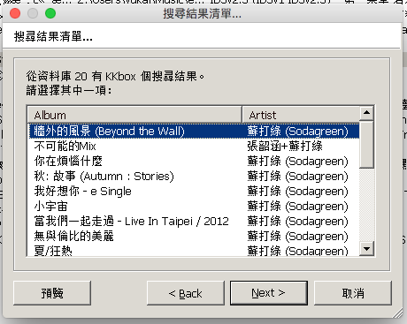
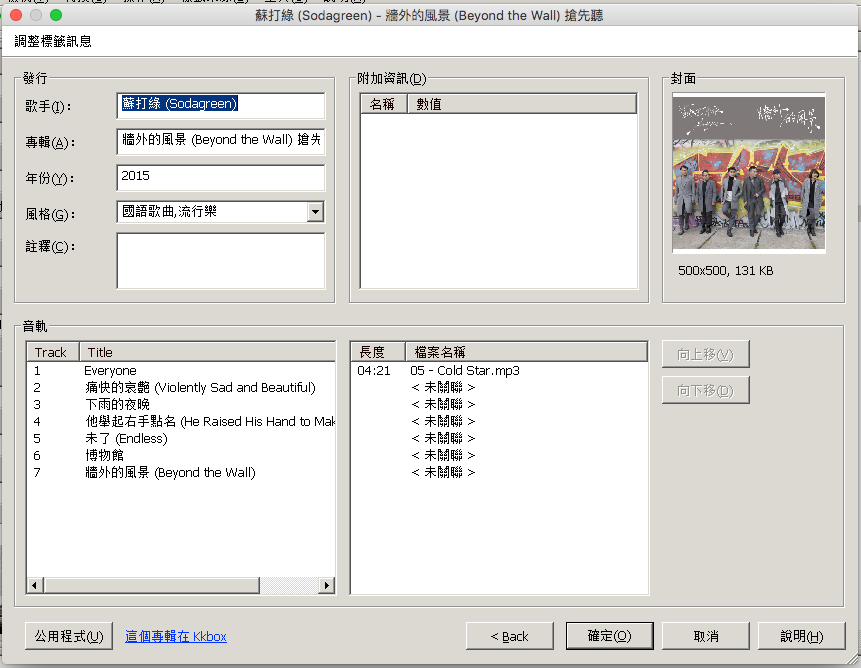

KKBox web source for Mp3Tag
=====================

# 說明

Mp3Tag 這傳奇性軟體的好就不用多說了 XD，如今在 OS X 底下我也找不到更好用的，只好用 wine 也裝了份。

Web source 是讓 Mp3Tag 可以支援不同站點資料，於是我就寫了份 KKBox 的。

`server` 資料夾放的是一個 node express server，本來想說放上 `heroku` 當做 proxy  api server 來著，解析 kkbox 資料回傳 json 比較方便，結果發現 kkbox 限定臺灣使用，除非 server 架在臺灣才有用啦$$$$$，還是給各位參考。

# 使用

把兩個 `.src` 檔丟到 `C:\Users\Username\AppData\Roaming\Mp3tag\data\sources` 附近。

